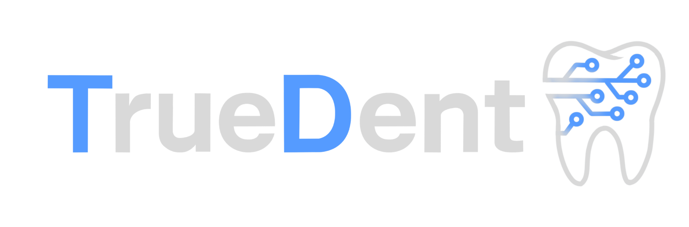

# TrueDent AI: Detección de caries con un solo click

TrueDent es un servicio que usa tecnologías de reconocimiento de imágenes mediante modelos CNN. Está pensado como un MVP para un proyecto final, pero con la arquitectura adecuada para ser escalable a futuro.

El usuario deberá introducir una pantomografía para que el sistema la descomponga en cada diente independiente y así poder diagnosticar correctamente las patologías. El MVP se limita a diferenciar entre cuales son los dientes sanos y cuales no son, pero se pretende poder entrar mas adelante en la fase de diagnóstico especificando las patologías.

## Explicación de Modelos

El planteamiento base es muy sencillo: se compone de tres modelos principales basado en Redes Convolucionales y un modelo generativo que desarrolla los diagnósticos en un párrafo explicando los motivos por los cuales ciertas patologías podrían ser encontradas en las radiografias de entrada.

| Modelo | Tipo | Función principal |                                                                                                   
|--------|------|-------------------|
| TD-detector_m1 | CNN (YOLOv8m) | Detecta y recorta automáticamente cada diente individual a partir de la pantomografía. |
| TD-class_m2 | CNN | Clasifica cada diente como **sano** o **no sano**. |
| TD-detector_m3 | CNN | Basándose en el resultado del modelo anterior, busca ciertas patologías especificadas por el usuario. |
| TD-diag_m4 | Modelo generativo (texto) | Genera un párrafo explicando posibles patologías basadas en los resultados de los modelos anteriores. |

 > El tercer modelo `TD_detector_m3`realmente es una agrupación de muchos modelos, para cada patología general habrá un modelo especializado en detectarlas, de esta forma se puede especializar y dividir el trabajo del flujo evitando el uso de modelos sobreentrenados y simplificando sus resultados

